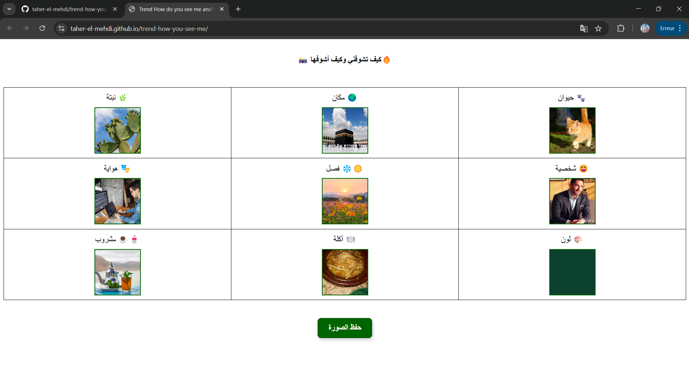

# How You See Me  
Inspired by a popular TikTok challenge, this web app lets users create a collage based on how they see another person. Participants upload images in nine different categories—such as animal, plant, character, food, and place—then compile them into a single image.

## 🎯 Features
- 📸 Upload 9 different images (Animal, Place, Plant, Personality, Season, Hobby, Color, Food, Drink)
- 🖼️ Live preview of uploaded images
- ⬇️ Download the generated image

Ta-da! 🎉

